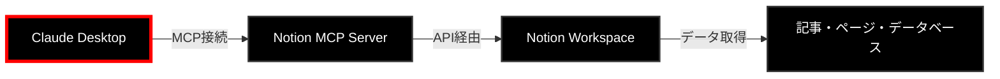
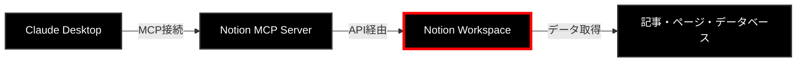
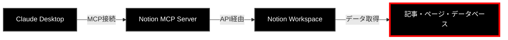

## 概要


Claude Desktop から Notion MCP (ローカル起動) に接続して、Notion記事に直接アクセスできるようにするための設定手順をまとめました。





📌 今ここ：Claude Desktopでの設定準備段階


基本的にGitHubの公式ドキュメント通りに進めれば大丈夫です！


参考：[GitHub - makenotion/notion-mcp-server](https://github.com/makenotion/notion-mcp-server?tab=readme-ov-file#installation)


## ステップ1：Notion Integrationの作成とトークン取得


まず、NotionでAPIアクセス用のインテグレーションを作成しましょう。





📌 今ここ：Notionでのインテグレーション作成


### 手順

1. **インテグレーション作成**
    - [https://www.notion.so/profile/integrations](https://www.notion.so/profile/integrations) にアクセス
    - 「新規インテグレーション」をクリック
    - ワークスペースを選択
2. **アクセス権限設定**
    - 「Access」タブから、アクセス許可したいページを選択
    - 必要に応じて読み取り/書き込み権限を設定
3. **トークン取得**
    - 生成されたトークンをコピーして保存（`ntn_*` で始まるもの）
    - ⚠️ このトークンは後で設定ファイルに使用するので、安全に保管してください

## ステップ2：Claude Desktop設定ファイルにMCP追加


次に、Claude Desktopの設定ファイルを編集してMCPサーバーを追加しましょう。


📌 今ここ：Claude Desktopの設定


### 設定手順

1. **設定ファイルを開く**
    - パス：`~/Library/Application Support/Claude/claude_desktop_config.json`
    - テキストエディタで開いてください
2. **設定内容を追加**

    ```javascript
    {
      "mcpServers": {
        "notionApi": {
          "command": "npx",
          "args": ["-y", "@notionhq/notion-mcp-server"],
          "env": {
            "NOTION_TOKEN": "ntn_****"
          }
        }
      }
    }
    ```


    💡 `NOTION_TOKEN`には、ステップ1で取得したトークンを入力してください

3. **Claude Desktopを再起動**
    - アプリケーションを完全に終了してから再起動
    - うまくいかない場合は、何度か再起動を試してみてください

## ステップ3：接続テスト


設定が完了したら、実際に動作するかテストしてみましょう。





📌 今ここ：接続確認とテスト


### テスト方法


Claude Desktopで「Notionページの〇〇のURLにアクセスできますか？」と聞いてみてください。


**成功例：**


このような画面が表示されれば、設定成功です！🎉


### トラブルシューティング

- 接続できない場合は、Claude Desktopの再起動を複数回試してみてください
- トークンが正しく設定されているか確認してください
- Notionでのアクセス権限設定を再度確認してみてください

## まとめ


Claude DesktopとNotion MCPの連携により、以下のことが可能になります：

- ✅ NotionページやデータベースへのAIからの直接アクセス
- ✅ 記事の分析や編集支援
- ✅ データベースの検索や情報抽出

**注意点：** 現時点ではローカルMCPのみの対応となっており、リモートMCPでは正常に動作しない可能性があります。


## 関連記事

- [GitHub - makenotion/notion-mcp-server: Official Notion MCP Server](https://github.com/makenotion/notion-mcp-server?tab=readme-ov-file#installation)
