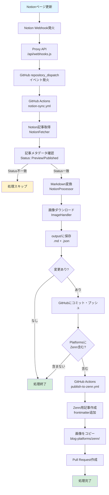
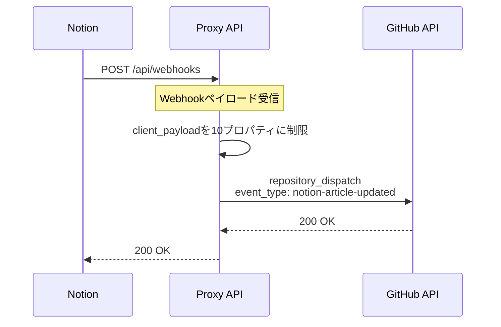
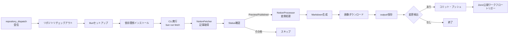
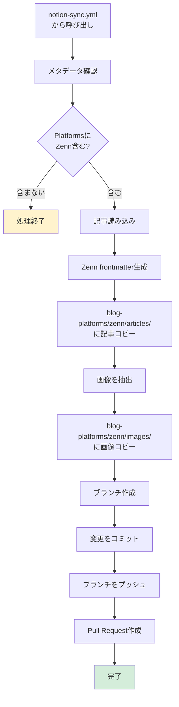
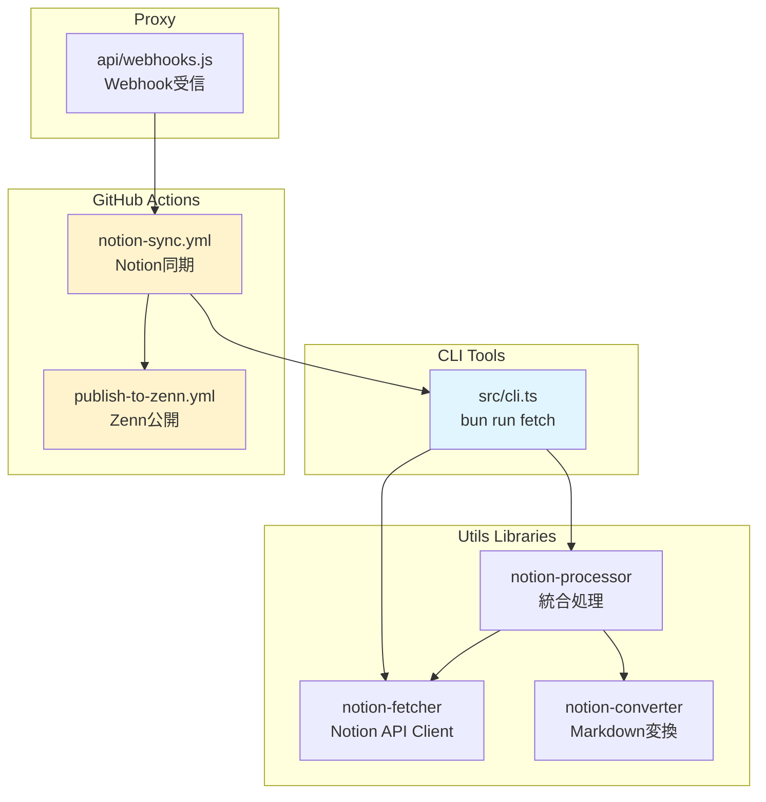
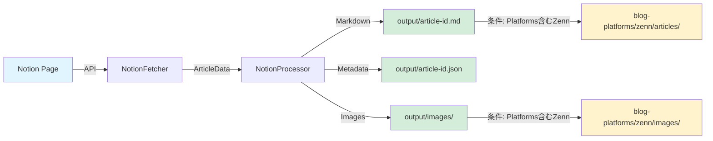
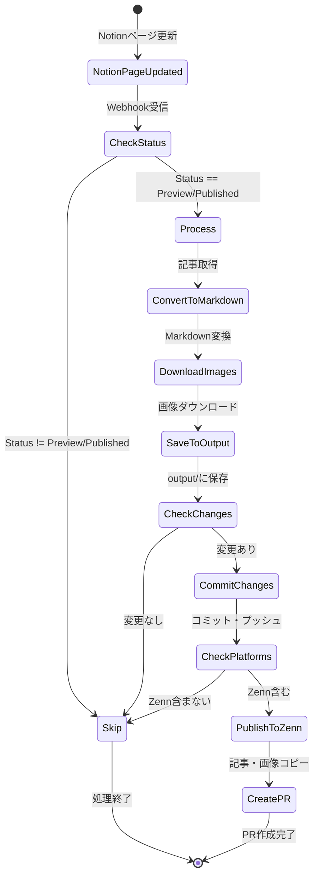

# Document Hub 処理フロー図

## 全体フロー

```mermaid
flowchart TD
    A[Notionページ更新] --> B[Notion Webhook発火]
    B --> C[Proxy API<br/>/api/webhooks.js]
    C --> D[GitHub repository_dispatch<br/>イベント発火]
    D --> E[GitHub Actions<br/>notion-sync.yml]
    
    E --> F[Notion記事取得<br/>NotionFetcher]
    F --> G[記事メタデータ確認<br/>Status: Preview/Published]
    G -->|Status不一致| H[処理スキップ]
    G -->|Status一致| I[Markdown変換<br/>NotionProcessor]
    I --> J[画像ダウンロード<br/>ImageHandler]
    J --> K[output/に保存<br/>.md + .json]
    
    K --> L{変更あり?}
    L -->|なし| M[処理終了]
    L -->|あり| N[GitHubにコミット・プッシュ]
    
    N --> O{Platformsに<br/>Zenn含む?}
    O -->|含まない| M
    O -->|含む| P[GitHub Actions<br/>publish-to-zenn.yml]
    
    P --> Q[Zenn用記事作成<br/>frontmatter追加]
    Q --> R[画像をコピー<br/>blog-platforms/zenn/]
    R --> S[Pull Request作成]
    S --> T[処理完了]
    
    style A fill:#e1f5ff
    style T fill:#d4edda
    style H fill:#fff3cd
    style M fill:#d4edda
```

## 詳細フロー

### 1. Notion Webhook → Proxy

```mermaid
sequenceDiagram
    participant N as Notion
    participant P as Proxy API
    participant G as GitHub API
    
    N->>P: POST /api/webhooks
    Note over P: Webhookペイロード受信
    P->>P: client_payloadを10プロパティに制限
    P->>G: repository_dispatch<br/>event_type: notion-article-updated
    G-->>P: 200 OK
    P-->>N: 200 OK
```

### 2. GitHub Actions - Notion同期

```mermaid
flowchart LR
    A[repository_dispatch<br/>受信] --> B[リポジトリチェックアウト]
    B --> C[Bunセットアップ]
    C --> D[依存関係インストール]
    D --> E[CLI実行<br/>bun run fetch]
    
    E --> F[NotionFetcher<br/>記事取得]
    F --> G[Status確認]
    G -->|Preview/Published| H[NotionProcessor<br/>変換処理]
    G -->|その他| I[スキップ]
    
    H --> J[Markdown生成]
    J --> K[画像ダウンロード]
    K --> L[output/保存]
    
    L --> M{変更検出}
    M -->|あり| N[コミット・プッシュ]
    M -->|なし| O[終了]
    N --> P[Zenn公開ワークフロー<br/>トリガー]
```

### 3. Zenn公開フロー

```mermaid
flowchart TD
    A[notion-sync.yml<br/>から呼び出し] --> B[メタデータ確認]
    B --> C{Platformsに<br/>Zenn含む?}
    C -->|含まない| D[処理終了]
    C -->|含む| E[記事読み込み]
    
    E --> F[Zenn frontmatter生成]
    F --> G[blog-platforms/zenn/articles/<br/>に記事コピー]
    G --> H[画像を抽出]
    H --> I[blog-platforms/zenn/images/<br/>に画像コピー]
    
    I --> J[ブランチ作成]
    J --> K[変更をコミット]
    K --> L[ブランチをプッシュ]
    L --> M[Pull Request作成]
    M --> N[完了]
    
    style D fill:#fff3cd
    style N fill:#d4edda
```

## コンポーネント構成

```mermaid
graph TB
    subgraph "CLI Tools"
        CLI[src/cli.ts<br/>bun run fetch]
    end
    
    subgraph "Utils Libraries"
        NF[notion-fetcher<br/>Notion API Client]
        NP[notion-processor<br/>統合処理]
        NC[notion-converter<br/>Markdown変換]
    end
    
    subgraph "GitHub Actions"
        NS[notion-sync.yml<br/>Notion同期]
        PZ[publish-to-zenn.yml<br/>Zenn公開]
    end
    
    subgraph "Proxy"
        WH[api/webhooks.js<br/>Webhook受信]
    end
    
    CLI --> NF
    CLI --> NP
    NP --> NF
    NP --> NC
    
    NS --> CLI
    NS --> PZ
    
    WH --> NS
    
    style CLI fill:#e1f5ff
    style NS fill:#fff3cd
    style PZ fill:#fff3cd
```

## データフロー

```mermaid
flowchart LR
    A[Notion Page] -->|API| B[NotionFetcher]
    B -->|ArticleData| C[NotionProcessor]
    C -->|Markdown| D[output/article-id.md]
    C -->|Metadata| E[output/article-id.json]
    C -->|Images| F[output/images/]
    
    D -->|条件: Platforms含むZenn| G[blog-platforms/zenn/articles/]
    F -->|条件: Platforms含むZenn| H[blog-platforms/zenn/images/]
    
    style A fill:#e1f5ff
    style D fill:#d4edda
    style E fill:#d4edda
    style F fill:#d4edda
    style G fill:#fff3cd
    style H fill:#fff3cd
```

## ステータス管理

```mermaid
stateDiagram-v2
    [*] --> NotionPageUpdated: Notionページ更新
    
    NotionPageUpdated --> CheckStatus: Webhook受信
    
    CheckStatus --> Skip: Status != Preview/Published
    CheckStatus --> Process: Status == Preview/Published
    
    Process --> ConvertToMarkdown: 記事取得
    ConvertToMarkdown --> DownloadImages: Markdown変換
    DownloadImages --> SaveToOutput: 画像ダウンロード
    SaveToOutput --> CheckChanges: output/に保存
    
    CheckChanges --> Skip: 変更なし
    CheckChanges --> CommitChanges: 変更あり
    
    CommitChanges --> CheckPlatforms: コミット・プッシュ
    
    CheckPlatforms --> Skip: Zenn含まない
    CheckPlatforms --> PublishToZenn: Zenn含む
    
    PublishToZenn --> CreatePR: 記事・画像コピー
    CreatePR --> [*]: PR作成完了
    
    Skip --> [*]: 処理終了
```

