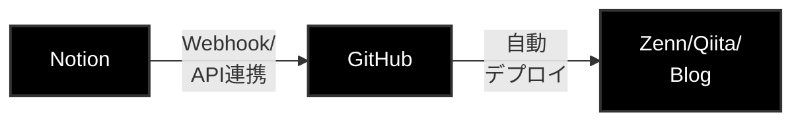
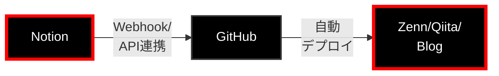
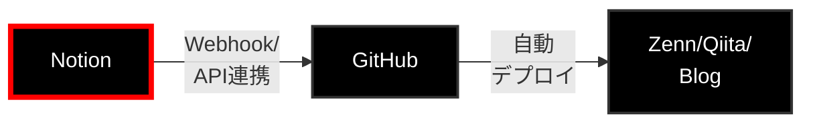
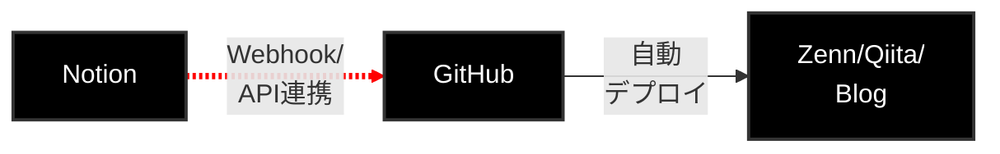
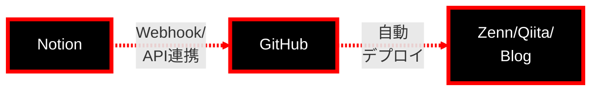

## 概要


エンジニアとして日々勉強したことを楽にアウトプットできたらいいなと思い、


Notionで作った記事を、ワンクリックで Githubに同期 → Zenn/Qiita/個人ブログにも公開できる仕組みを作ってみました！





## 前提条件

- Github / Github Actionsを使ったことがある
- 必要なツール・環境
    - Notion
    - Git
    - Node.js
    - GitHub

## ステップ1：環境の準備


### このステップで準備する要素





📌 **今ここ：** Notion、GitHub、公開プラットフォームの準備


### Notion記事管理データベースの作成

- 「WIP」「Preview」「Published」のステータスカラムを用意
- 例: こんな感じのデータベースに記事をつくっていき、「Status」カラムで公開ステータスを変更していくイメージです

### GitHubリポジトリの作成

- https://github.com/majikana-rinadehi/document-hub

### 公開プラットフォームのアカウント準備

- ZennやQiita、個人ブログなど、最終的に記事投稿したいプラットフォームのアカウントを用意しておきます

## ステップ2：Notionインテグレーションの作成


### 📍 このセクションの位置（全体フロー）





📌 **今ここ：** Notion API経由でデータを取得するための認証設定を行います


まず、GitHubからNotionのデータにアクセスするために、Notionインテグレーションを作成します。


### Notion統合の作成とAPIトークン取得


### 手順

1. [Notion統合ページ](https://www.notion.so/my-integrations)にアクセスします
2. 「新しいインテグレーション」→　Typeは「内部インテグレーション」(Internal)を選択して、インテグレーションを新規作成します
3. 内部インテグレーションシークレットが表示されているので、後でGithub Actions側に設定するために値をコピーしておきます

[🖼️ 画像1]


### データベースとの接続設定


作成した統合を記事管理用データベースに接続します。


### 手順

1. [統合管理ページ](https://www.notion.so/my-integrations)で作成した統合を選択します
2. 「Access」タブから「Select page access」で、先ほど作った記事管理用データベースを選択します
    - データベースの名前で検索できます
3. Notionの記事管理用データベースページの右上「…」→「Connections」に統合が追加されることを確認します
    - 統合が表示されていればOKです

## ステップ3：Notion ⇔ GitHub の連携


### 📍 このセクションの位置（全体フロー）





📌 **今ここ：** NotionとGitHubを連携して、記事更新時にWebhook経由でGitHub Actionsをキックする仕組みを作ります


---


### 3.1 プロキシサーバーの用意


NotionのWebhookからGitHub Actionsを起動するには、GitHubの認証情報をヘッダーに含める必要があります。そこで、Notion → GitHub の間に Vercel Function でプロキシサーバーを挟んで、認証情報を追加してからGitHubに転送するようにします。


### 実装


`proxy/api/` 配下に下記のようなエンドポイントを作って `vercel` コマンドでデプロイします。


### `proxy/api/webhooks.js`


```javascript
import { Octokit } from "@octokit/rest";

export default async function handler(req, res) {
  // CORSヘッダー設定
  res.setHeader("Access-Control-Allow-Origin", "*");
  res.setHeader("Access-Control-Allow-Methods", "POST, OPTIONS");
  res.setHeader("Access-Control-Allow-Headers", "Content-Type");

  // OPTIONSリクエスト対応
  if (req.method === "OPTIONS") {
    return res.status(200).end();
  }

  // POSTリクエストのみ許可
  if (req.method !== "POST") {
    return res.status(405).json({ error: "Method not allowed" });
  }

  try {
    console.log("=== Notion Webhook Received ===");
    console.log("Headers:", req.headers);
    console.log("Body:", req.body);

    // GitHub APIクライアント初期化
    const octokit = new Octokit({
      auth: process.env.GITHUB_TOKEN,
    });

    // NOTE: No more than 10 properties are allowed; 12 were supplied.
    const clientPayload = { ...req.body };
    // client_payloadのプロパティ数を10に制限
    // 次は必ず含む: id, timestamp, data, type, entity, authors, integration_id, subscription_id, workspace_name, workspace_id
    const allowedKeys = [
      "id",
      "timestamp",
      "data",
      "type",
      "entity",
      "authors",
      "integration_id",
      "subscription_id",
      "workspace_name",
      "workspace_id",
    ];
    Object.keys(clientPayload).forEach((key) => {
      if (!allowedKeys.includes(key)) {
        delete clientPayload[key];
      }
    });

    // repository_dispatch実行
    await octokit.rest.repos.createDispatchEvent({
      owner: process.env.GITHUB_OWNER,
      repo: process.env.GITHUB_REPO,
      event_type: "notion-article-updated",
      client_payload: {
        ...clientPayload,
      },
    });

    console.log("GitHub Actions triggered successfully");

    return res.status(200).json({
      success: true,
      message: "Webhook processed successfully",
    });
  } catch (error) {
    console.error("Error processing webhook:", error);

    return res.status(500).json({
      success: false,
      error: error.message,
    });
  }
}
```


### 注意点


### ⚠️ Vercel認証の無効化


Vercelの「Project Settings」→「Deployment Protection」→「Vercel Authentication」をOFFにしておきましょう。これをやらないとWebhookリクエストで401エラーになります。


### ⚠️ client_payloadの制限


GitHub Actionsの `client_payload` は10個までしかプロパティを渡せないので、必要最小限のプロパティに絞ってます。


---


### 3.2 [Notion] Webhookの設定


Notion側の記事更新時にGitHub Actionsを起動させたいので、インテグレーションに [Notion Webhook](https://www.notion.com/ja/help/create-integrations-with-the-notion-api#webhook%E3%82%A4%E3%83%B3%E3%83%86%E3%82%B0%E3%83%AC%E3%83%BC%E3%82%B7%E3%83%A7%E3%83%B3) を設定します。


### Webhook URL


プロキシサーバーのURLを指定します。


```plain text
https://xxx.vercel.app/api/webhooks
```


※ 初回の認証でこのエンドポイントに認証情報が送られてくるので、Vercel Functionsのログで確認できます。


### Subscribed events


「**Page properties updated**」を選択します。


これで、Notion側で記事の `Status` カラムが変更されたときにWebhookが発火して、GitHub Actionsがトリガーされます。


---


### 3.3 [GitHub] Personal Access Token (PAT)の設定


GitHub ActionsのAPIを呼び出すために必要なPATを生成します。詳細は [GitHub API ドキュメント](https://docs.github.com/ja/rest/repos/repos?apiVersion=2022-11-28#create-a-repository-dispatch-event) を参照してください。


このPATの値は Vercel Functions の環境変数 `GITHUB_TOKEN` に設定して、ヘッダーに含めて認証情報としてGitHub Actionsに送ります。


### 必要な権限

- `repo` (リポジトリへのフルアクセス)
- `workflow` (GitHub Actionsワークフローの実行)

## ステップ4：GitHub側の準備


### Actionsの用意

- `.github/workflows/` 配下に、下記のようなトリガーでActionsを新規作成・実装していきます
    - `on: repository_dispatch` でNotionからのWebhookをトリガーに設定
    - `types: [notion-article-updated]` で特定のイベントタイプのみ反応

### publish-to-zenn.yml


例: Zenn用のワークフロー設定


```yaml
name: Publish to Zenn
on:
  repository_dispatch:
    types: [notion-article-updated]
jobs:
  publish:
    runs-on: ubuntu-latest
    steps:
      - uses: actions/checkout@v3
      - name: Setup Node.js
        uses: actions/setup-node@v3
        with:
          node-version: '18'
      - name: Install dependencies
        run: npm install
      - name: Fetch from Notion
        env:
          NOTION_TOKEN: ${{ secrets.NOTION_TOKEN }}
        run: node scripts/fetch-notion.js
      - name: Convert to Markdown
        run: node scripts/convert-markdown.js
      - name: Deploy to Zenn
        run: |
          cp -r output/articles ./articles
          cp -r output/images ./images
```


### 変換スクリプトの実装


GitHub Actionsに、下記のスクリプトを組み込んでいきます

- Notionページ情報の取得
    - Notion APIを使って、記事のメタデータと本文を取得
    - 使用するブロックタイプ: paragraph, heading, bulleted_list_item, code, image など
- Markdown変換処理
    - Notionのブロックデータをマークダウン形式に変換
    - 画像URLの処理やコードブロックのシンタックスハイライト設定

### Zenn連携


記事にZennタグが付けられている場合、Zennにもデプロイします。

- [Zenn CLI](https://zenn.dev/zenn/articles/install-zenn-cli)を使用してデプロイします
- outputの内容を`{articles|images}`にコピーします

### Zennメタデータの設定


| プロパティ     | 説明      | 設定例                      |
| --------- | ------- | ------------------------ |
| title     | 記事タイトル  | Notionのタイトルから取得          |
| emoji     | 記事のアイコン | Notionのアイコンから取得          |
| type      | 記事タイプ   | "tech" or "idea"         |
| topics    | タグ      | Notionの"Tag"カラムから取得      |
| published | 公開状態    | Statusが"Published"ならtrue |


### [TODO] Qiita / 個人ブログ


→同じように、Qiita API や個人ブログのデプロイ設定を追加していきます


## ステップ4：テスト


### 📍 このセクションの位置（全体フロー）





📌 **今ここ：** 全体の実装が完了したので、実際に動作するかテストします


---


## テスト方法


ここでは、Notionで記事のステータスを変更して、実際にGitHub経由でZennなどに記事が公開されるかを確認します。


### テスト用記事の準備


まずはテスト用の記事を作成しましょう。

1. Notionの記事管理データベースで新しいページを作成
2. タイトルと本文を簡単に書く（テスト用なので「これはテスト記事です」程度でOK）
3. 「Platforms」カラムで「Zenn」を選択
4. 「Status」カラムを「WIP」に設定

### 実際にテストしてみる


記事の準備ができたら、実際に公開フローを動かしてみます。

1. **ステータスを「Preview」に変更**
    - Notionで記事の「Status」を「WIP」→「Preview」に変更
    - これでWebhookが発火します
2. **GitHub Actionsの実行を確認**
    - GitHubリポジトリの「Actions」タブを開く
    - 新しいワークフローが実行されているか確認（通常30秒〜1分で開始）
    - ログを見て、エラーが出ていないかチェック
3. **リポジトリの更新を確認**
    - GitHub上で `articles/` や `images/` ディレクトリに新しいファイルが追加されているか確認
    - マークダウンファイルの内容が正しく変換されているか確認
4. **Zenn での公開を確認**
    - Zenn の管理画面を開く
    - 記事が正しく投稿されているか確認
    - プレビューで表示を確認

---


## 成功の確認方法


テストが成功しているかは、以下のポイントでチェックできます。


### ✅ Webhook が正常に動作しているか

- Vercel Functions のログに Webhook リクエストが記録されている
- ログに `GitHub Actions triggered successfully` が出力されている

### ✅ GitHub Actions が正常に実行されているか

- GitHub の Actions タブでワークフローが緑色（成功）になっている
- ワークフローの各ステップが完了している
    - Notion API からのデータ取得
    - Markdown への変換
    - リポジトリへのコミット
    - Zenn/Qiita へのデプロイ

### ✅ 記事が正しく公開されているか

- Zenn/Qiita の管理画面で記事が表示されている
- 画像が正しく表示されている
- フォーマットが崩れていない
- メタデータ（タグ、カテゴリなど）が正しく設定されている

---


## トラブルシューティング


よくあるエラーとその対処法をまとめました。


### ❌ Webhook が発火しない


**症状**

- Notionでステータスを変更しても何も起こらない
- Vercel Functions のログに何も記録されない

**対処法**

- Notion の統合設定で Webhook URL が正しく設定されているか確認
- Vercel の「Deployment Protection」で認証が無効になっているか確認
- Webhook のステータスが "Active" になっているか確認

### ❌ GitHub Actions が失敗する


**症状**

- Actions タブでワークフローが赤色（失敗）になっている

**対処法**

- ログを確認して、どのステップで失敗しているか特定
- よくある原因：
    - `NOTION_TOKEN` が正しく設定されていない → Secrets を再確認
    - Notion のページ ID が取得できない → Webhook のペイロードを確認
    - 権限エラー → GitHub Token の権限を確認

### ❌ 記事の変換がおかしい


**症状**

- 記事は公開されるが、フォーマットが崩れている
- 画像が表示されない
- コードブロックがうまく変換されていない

**対処法**

- Notion の記事で使っているブロックタイプを確認（一部のブロックは未対応の可能性）
- 画像 URL が正しく取得できているか確認
- 変換スクリプトのログを確認して、どこで問題が起きているか特定

### ❌ Zenn/Qiita に公開されない


**症状**

- GitHub Actions は成功しているのに、Zenn/Qiita に記事が表示されない

**対処法**

- Zenn: リポジトリとの連携が正しく設定されているか確認
- Qiita: API トークンが正しく設定されているか確認
- 記事のメタデータ（published フラグなど）が正しく設定されているか確認

---


これでテストは完了です！うまく動いたら、実際の記事で運用を始めましょう 🎉


## ステップ5：デプロイ・運用

- デプロイ手順
- 監視ポイント
- メンテナンス方法

## まとめ

- 学んだこと（3-5項目）
- 次に学ぶべきこと
- 関連リソース（3個まで）
