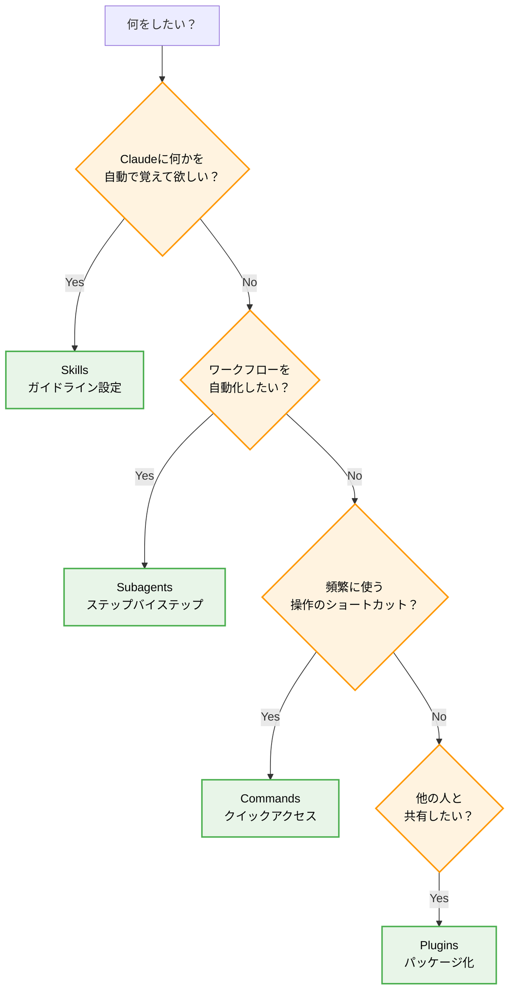

---


Claude Codeを使っていると、Skills、Subagents、Commands、Pluginsという似たような機能名に出会います。違いがいまいちわからず悩んでいましたが、[Understanding Claude Code: Skills vs Commands vs Subagents vs Plugins | #95](https://www.youngleaders.tech/p/claude-skills-commands-subagents-plugins)という記事を見かけ、こちらに分かりやすくまとまっていたので、実際に試してみた体験を加えて整理し直してみました。


## 判断基準


### フローチャート





元記事の決定フローは分かりやすかったのですが、実際に使ってみると微妙なニュアンスが分からず迷いました。特に「自動化」と「ショートカット」の違いが曖昧だったので、具体例を加えて整理し直してみました!


### 決定ルール（実用版）


| 目的                       | 選択する機能        | 具体例                |
| ------------------------ | ------------- | ------------------ |
| "Claudeに○○を自動で覚えてほしい"    | **Skills**    | コーディング規約、文体ガイドライン  |
| "△△ワークフローを自動化したい"        | **Subagents** | ドキュメント作成の手順定義      |
| "よく使うサブエージェントにすぐアクセスしたい" | **Commands**  | ワークフローを呼び出すショートカット |
| "設定を他の人と共有したい"           | **Plugin**    | 上記3つをパッケージ化        |


**参考記事の判定ルール（英語版）**：

- "I want Claude to remember X automatically" → **Skill**
- "I want to automate Y workflow step-by-step" → **Subagent**
- "I use subagent Z frequently and want a shortcut" → **Command**
- "I want to share my setup with others" → **Plugin** (bundle all three)

## Skills：記憶させるガイドライン


毎回同じ指示をするのが面倒で、「Claudeがこのルールを覚えてくれたらなあ」と思ったことありませんか？私も技術記事を書くときに、毎回「カジュアルな文体で」「具体例を含めて」「読者の立場を考えて」と説明するのが手間でした。


### 実装内容


Skillsは**ガイドラインファイル**として実装されます：

- **コーディング規約**: 「関数には必ずTypeScript型を付ける」
- **文章スタイル**: 「ですます調で、専門用語には説明を添える」
- **レビュー観点**: 「セキュリティとパフォーマンスを重視」
- **回答形式**: 「結論を先に、理由は後で」

```markdown
# 技術記事執筆スキル

## 基本方針
- カジュアルで読みやすい文体
- 具体例を必ず含める
- 読者の疑問を先回りして解決

## 避けるべき表現
- 専門用語の羅列
- 結論のない長文
```


実際に使ってみると、Skillsは「背景で常に動いている指示書」のような感覚です。一度設定すれば、その後のやり取りで自動的に適用されるので、一貫性のある出力が得られるようになりました。「あー、また同じこと説明してる...」という悩みが解消されました！


## Commands：頻用操作のショートカット


便利なSubagentを作ったものの、毎回「○○エージェントを実行して」と説明するのは面倒です。


スマホアプリのショートカットのように、簡単なコマンドで呼び出せたらいいのにと思いました。


### 実装内容


Commandsは**カスタムスラッシュコマンド**として動作します：


```plain text
/blog → ブログ記事作成エージェントを起動
/docs → ドキュメント作成エージェントを起動
/review → コードレビューエージェントを起動
/format → コード整形エージェントを起動
```


実際に使ってみると、Commandsは「頻繁に使う機能へのクイックアクセス」として非常に便利でした。タイピング量が減るので、作業効率が格段に向上します。「この長い指示文、何回も書いてるなー」という問題が一発で解決しました！


### 🤔 Claude Desktopでの対応状況


カスタムスラッシュコマンドはClaude Code特有の機能なので、Claude Desktop単体では使えません。でも、似たような効果は実現できることが分かりました。


**Claude Desktopでの代替案**：

- **プロジェクト設定**: よく使う指示を保存
- **履歴活用**: 過去のやり取りをコピペ
- **外部連携**: 他のツールと組み合わせ

## Subagents：ワークフローの自動化


記事を書くとき、「まず構成を考えて、次にアウトラインを作って、それから本文を...」という手順がありますよね。毎回この流れを説明するのは大変なので、ワークフロー全体を定義できないかと思いました。


### 実装内容


Subagentsは**複数ステップの処理フロー**を定義します：

- **技術記事作成**: 企画 → 構成検討 → 執筆 → 校正 → 公開準備
- **プロジェクト立ち上げ**: 分析 → 要件整理 → 設計 → 実装計画
- **データ分析**: 収集 → 前処理 → 分析 → 可視化 → レポート

```yaml
name: "ドキュメント作成エージェント"
steps:
  1. "要件を分析し、読者を特定する"
  2. "構成とアウトラインを作成する"
  3. "各セクションの内容を執筆する"
  4. "全体を校正し、一貫性を確認する"
```


使ってみて感じたのは、Subagentsは「作業の標準化」に最適だということです。人間がやると忘れがちな手順も、きちんと順番通りに実行してくれるので、品質の安定した成果物が得られます。「この作業、いつも同じ手順でやってるなー」という問題がまさに解決されました！途中で「ちょっと確認したい」って時もちゃんと待ってくれるので安心です。


## Plugins：設定の共有パッケージ


便利な設定を作ったら、チームメンバーにも使ってもらいたいですよね。でも「このSkillファイルと、このSubagentと、このCommandを設定してね」と個別に説明するのは大変です。


### 実装内容


Pluginは**Skills + Subagents + Commands**を一つのパッケージにまとめます：

- **「技術ブログ執筆セット」**: 執筆ルール + 記事コマンド + 執筆ワークフロー
- **「React開発セット」**: コーディング規約 + React用コマンド + 開発フロー
- **「データ分析セット」**: 分析ガイド + 分析コマンド + レポート作成フロー

```plain text
tech-writing-plugin/
├── skills/
│   └── writing-guidelines.md
├── subagents/
│   └── blog-creator.yaml
├── commands/
│   └── shortcuts.yaml
└── plugin.json
```


Pluginを使うと、設定の配布が格段に楽になりました。「このプラグインをインストールして」の一言で、複雑な設定が一括で適用されるのは本当に便利です。チーム全体で統一された環境を構築できるので、新しいプロジェクトを始める時や新メンバーが参加した時に重宝しています。


## まとめ


Claude機能を理解するには、頭の中で整理するよりも実際に使ってみることが一番でした。最初は混乱していた機能の違いも、段階的に導入することで自然と理解できるようになりました。


この記事をまとめながら感じたのは、Claude機能は「使い分け」よりも「組み合わせ」が重要だということです。各機能を単独で使うのではなく、連携させることで真の威力を発揮します。皆さんも、まずは小さなSkillsから始めて、徐々に自分だけのClaude環境を構築してみてください。


## 参考情報

- [Understanding Claude Code: Skills vs Commands vs Subagents vs Plugins | #95](https://www.youngleaders.tech/p/claude-skills-commands-subagents-plugins)
- Claude Code公式ドキュメント
- Claude Desktop機能比較
