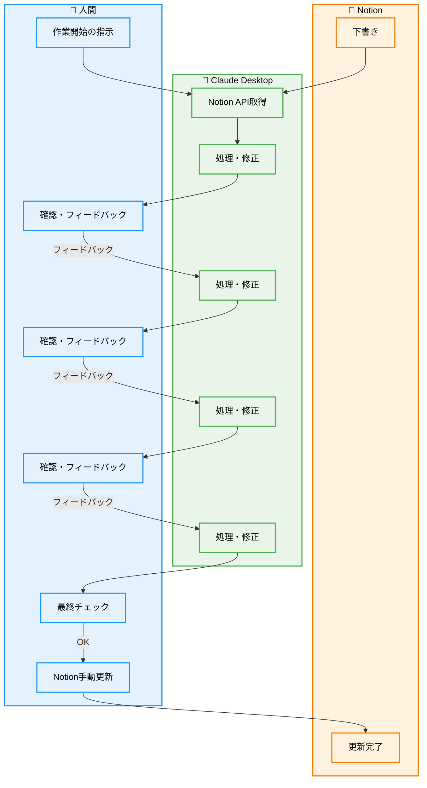
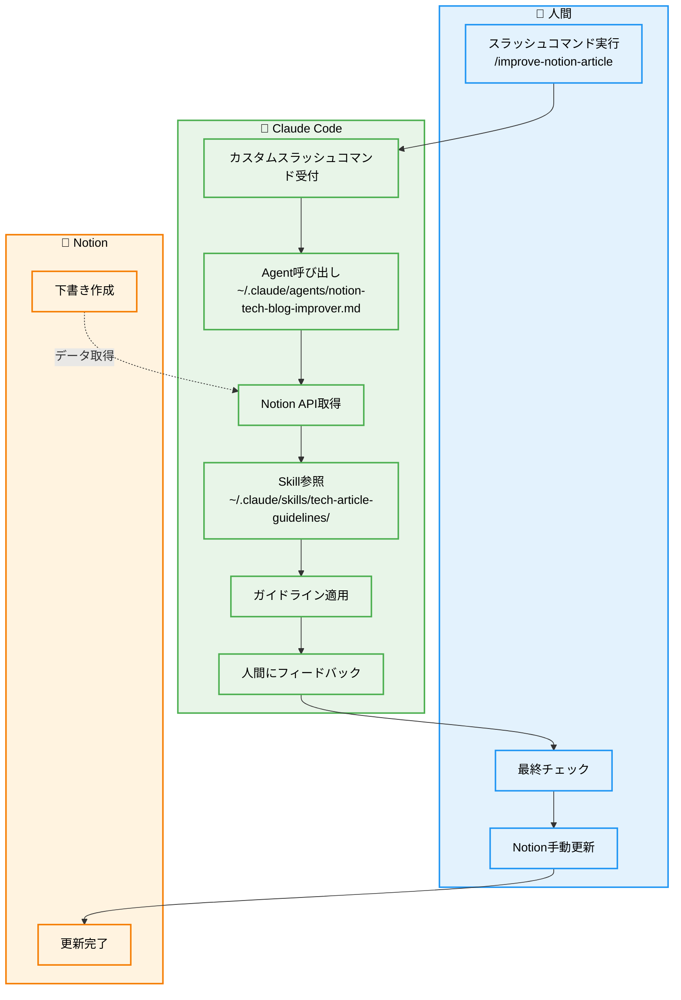

## Claude に書かせた記事って読みにくい?


最近、Notionのメモ書きをClaude Desktopに読ませて、いい感じの技術記事に仕上げられないか試していたのですが、正直「なんか読みにくいな...」「これ本当に人間が読みたくなる記事になってる？」と感じており、


- 文章が冗長で読みにくい
- 図や視覚的要素が不足
- セクションごとのフォーマットが不統一
- 機械的で共感しにくい文体
- ストーリー性の欠如


このように、正直どれも「AIが書いた感」が拭えなくて、自分が読者だったら最後まで読まずに離脱しそうな内容でした。(それっぽいのがすぐ上がってくるのはいいんですけど…)


少しでもこの問題を解決して、Claudeでも人間にとって読みやすく、認知負荷の低いドキュメントを効率的に作成させたい、と思い試行錯誤してみました！


## 背景


技術記事を書くときって、いつも「どう書けば読者に伝わるかな？」って悩むんですよね。特にClaude Desktopを使い始めた頃は、便利そうだと期待していたのですが、Claudeに書かせると、

- 文章が冗長、背景情報が不足
- フォーマットがばらばら
- 文体が機械的で、共感しにくい

どうしてもこうなっちゃうんですよね…回避策として、納得行くものになるまで都度プロンプトで修正指示していたのですが、何往復も必要だし、最終成果物の品質も安定せず。結構ストレスでした。


## 現状分析


まず、現状Claudeで生成した記事のそもそも何が問題なんだろう？を改めて詳しく分析してみました。


### 1. 文章が冗長

- 生成される文章が必要以上に長く、要点が把握しにくい状態でした。


AIあるあるな気がするんですが、まず文字数が単純に多い… (半分の文字数で言えることを、倍近くに膨らませてくる感があります)


あと文体自体も仰々しいというか、読んでいて「要するに何が言いたいの？」と思うことが多く、正直読むのも疲れるような感じでした。


### 2. フォーマットがばらばら

- 同じ記事内で複数の表現形式が混在していました：

    **例：良い例・悪い例の表現**

    - 「✅ **良い例** / ❌ **ダメな例**」
    - 「**良い例** / **悪い例**」
    - 「なぜダメ？」「改善方法」

確かに。一つの記事で表現方法がコロコロ変わるって、読者としてはそこそこストレスなんですよね。。。


### 3.文体が機械的

- 事実の列挙に終始し、人間の感想や解釈が不足していました。

### 4.手戻りが多い

- 納得できる記事になるまで **7回のセッション** を要した
- 最終的にも完全に満足できる結果は得られていない


7回もやり直したのに満足いくものができなかったときは、正直「時間の無駄だったかも...」と落ち込みました。


## 根本原因


Claudeに書かせるとなぜこうなるのか、もう少し掘り下げてみることにしました。

1. **ガイドライン不在**: ドキュメントの理想的な形が定義されていない
2. **経験不足**: 技術記事執筆の経験とプロセスが確立されていない
3. **プロンプト設計**: 指示が曖昧で具体性に欠ける
4. **下書きの質**: 人間が作成した初期情報が不十分


確かにそもそも記事のガイドラインも用意してないので、それはそうですね。。。なので、AIに「いい感じに書いて」って言っても、そもそも「いい感じ」ってなにか、の具体的な基準が伝わってなさそうです。


あと、人間の経験不足はしょうがないとして、プロンプトが曖昧もそのとおり。


## 解決策


いくつか思いつくアプローチがあったので、メリット・デメリットを整理してみました。


### ✅アプローチ1：ガイドライン作成


**概要**: ドキュメントの理想形を具体例とともに定義し、プロンプトに組み込む


**メリット**:

- 成果物の品質安定化
- 人間の作成指針としても活用可能

**デメリット**:

- テンプレート化によるコンテンツの単調化
- メンテナンスコスト

**実現可能性**: 高（フォーマットガイドラインから着手可能）


### ✅アプローチ2：プロンプト改善


**概要**: ガイドライン参照機能と人間の感想追記システムをプロンプトに統合


**メリット**: 仕組みとしての標準化が可能
**デメリット**: 効果確認のための試行錯誤が必要
**実現可能性**: 高


### 🔺アプローチ3：他AI検討


**概要**: Gemini、ChatGPT等の代替AI活用の検討


**メリット**: 新たな可能性の発見
**デメリット**: コスト、学習コスト
**実現可能性**: 低（優先度が低い）


検討した結果、「ガイドライン作成」と「プロンプト改善」でやってみようと思いました。(「他AI検討」は正直Claude以外試すの面倒、で今回は見送り…)


### 実装方針

1. **ドキュメントのガイドライン**をMarkdownで作成
2. **ドキュメント作成のプロンプト**の改善
3. **Claude Code**への移行
    - `~/.claude/skills/`にガイドライン配置
    - `~/.claude/agents/`に改善実行プロンプト配置
    - 上記実行するカスタムスラッシュコマンドを用意

まず技術記事のガイドラインを用意し、改善実行のプロンプト自体も改善しました。


また、記事作成のワークフロー自体も、もともとClaude Desktopを使っていましたが、カスタムコマンド / Subagent / Agent Skills を備えており、より仕組み化しやすいClaude Code に移行しました!


### 改善前のワークフロー





### 改善後





## 結果の検証


完成したカスタムスラッシュコマンドを実行し、実際に既存のNotion記事を改善させてみました。


```bash
/improve-notion-article <https://www.notion.so/Claude-29e354cfb4ef80a7ad7be9c6b1e31bdd>
```


### 検証結果


### 1回目の結果

- ✅ **ガイドライン作成完了**: agent skillとして体系化
- ✅ **効率化達成**: 2-3回のプロンプトで80%品質の記事生成
- ❌ **人間性注入不足**: 事実95%：解釈5%の比率で機械的


1回目は期待した通りにはいきませんでした。「まだまだ機械的だな...」という感想。ただ、効率化は確実に実感できたので、方向性は間違ってなさそうでした。


### 改善サイクル


**2回目**: 人間の解釈・感想の重要性を強調したが効果限定的


**3回目**: ガイドラインで人間要素を最優先事項として明記

- 的確な人間らしい感想の自動挿入を実現
- 共感できる解釈の生成に成功


3回目でやっと「これだ！」という感覚が得られました。AIが生成した感想を読んで「あ、これ人間が書いたみたい」と思えるレベルになったんです。思っていた以上にうまくいきました。


### 定性的改善

- **構造化**: スラッシュコマンド一発でドキュメントが整理された形に
- **可読性**: 人間の感想と事実のバランスが向上
- **効率性**: 手戻り回数の大幅削減

### 残課題

- AI生成感想には事実誤認が含まれる場合があり人間チェックが必須
- 見出しのフォーマットにまだ不統一が残存


完璧とは言えませんが、Claudeに自然な記事を書かせるという目標は達成できました。残った課題もなんとかなりそうな気がします。


## まとめ


やってみて良かったなと思います。最初は「技術記事をもっと読みやすくしたい」という単純な動機でしたが、結果的にAIとの付き合い方について深く学べました。


### 学び

1. **継続改善の効果**: 最初は困難と思われた課題も、skill/agents の継続的改善で想定以上の成果を達成
2. **システム理解の深化**: skill/agents/command の役割分担が明確化
    - **skill**: 理想形と手順書
    - **agents**: skillを活用する実行エンジン
    - **command**: 実行エンジンを起動するインターface
3. **プロンプト設計の重要性**: 具体例と優先順位の明示が成功の鍵
4. **理想像の明文化**: 「あるべき姿」の人間側での理解とプロンプトでの例示が必須


特に「理想像の明文化」が重要だということを実感しました。AIに「いい感じに」とお願いしても、人間が思う「いい感じ」を具体的に伝えなければ、AIも困ってしまうんですよね。


その点、agent / skillという形で、理想像を明文化しておけるClaude Codeは便利だな、と改めて感じました。


### 次のアクション

1. この改善レポート自体をシステムで改善して技術記事として投稿
2. ガイドライン内容の継続的改善
3. 他の記事タイプへの展開検討

### 継続改善ポイント

- **効率性**: トークン消費量と処理時間の最適化
- **品質**: ガイドライン内容（構成・語調）の精査
- **自動化**: より多くの記事タイプへの対応拡張


一番嬉しかったのは、この取り組み自体が「人間とAIの協力」の良い例になったことです。AIの得意なことと人間の得意なことをうまく組み合わせることで、どちらか一方だけでは達成できない成果が得られました。これからも継続的に改善していきたいと思います!


